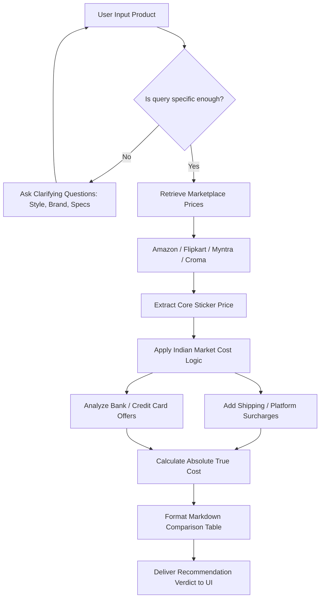

# BargainHound 🛍️ (Sale Shopper AI)

An advanced, analytical, and relentlessly objective e-commerce shopping assistant explicitly optimized for the Indian consumer market[cite: 2]. Powered by the modern **Google GenAI SDK**, **Streamlit**, and an autonomous backend database layer for persistent conversations[cite: 2].

---

## ✨ Features

*   **Exclusively Tailored for India:** Seamlessly processes pricing structures, context, and data across top Indian online marketplaces including Amazon India, Flipkart, Myntra, Tata CLiQ, Croma, Reliance Digital, and JioMart[cite: 2].
*   **True Cost Formula:** Looks beyond raw sticker prices to calculate the *actual* final checkout amount by factoring in shipping rates, COD fees, platform convenience charges, and premium subscription demands (e.g., Amazon Prime)[cite: 2].
*   **Upcoming Festival Sale Mode:** Features an interactive sidebar toggle that recalibrates the AI model's temperature and instructions to predict and analyze historical price drops during seasonal events like Diwali, Big Billion Days, or Republic Day sales[cite: 2].
*   **Persistent Memory Layer:** Includes a complete local session history management system integrated with a SQLite database backend to save, load, and delete previous chat histories without data loss across browser reloads[cite: 2].

---

## 🛠️ System Architecture & Logic Flow



---

## ⚙️ Tech Stack

*   **Frontend UI:** Streamlit[cite: 2]
*   **LLM Engine:** Google Gemini (`gemini-2.5-flash`)[cite: 2]
*   **Orchestration SDK:** `google-genai`[cite: 2]
*   **Database Memory:** SQLite3[cite: 2]
*   **Environment Management:** `python-dotenv`[cite: 2]

---

## 🚀 Installation & Local Deployment

Follow these quick steps to get a local instance of your application running inside an isolated development workspace.

### 1. Clone the Workspace
```bash
git clone [https://github.com/YOUR_USERNAME/Bargain-Hound.git](https://github.com/YOUR_USERNAME/BargainHound-AI-Shopper.git)
cd BargainHound-AI-Shopper
```

### 2. Install Required Dependencies
Ensure you install the explicit dependencies required for your runtime environment[cite: 2]:
```bash
pip install streamlit google-genai python-dotenv
```

### 3. Set Up Environment Secrets
Create a secure configuration file named `.env` in the root folder of your project workspace and input your authenticated Google developer credentials[cite: 2]:
```text
API_KEY=YOUR_ACTUAL_GEMINI_API_KEY_HERE
```

### 4. Boot the Execution Stream
Execute the core chatbot routing module through the command terminal[cite: 2]:
```bash
streamlit run chatbot.py
```

---

## 🗂️ Project Directory Structure

```text
├── chatbot.py          # Main Streamlit orchestration and chat interface logic
├── history_db.py       # SQLite interaction layer for message persistent workflows
└── README.md           # Visual deployment tracking manual and project layout
```
